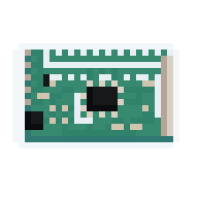

<h1 align="center">
  
  <p align="center">
    I²C PWM Board
  </p>
</h1>

**ROS2** node for controlling PWM boards based on the PCA9685 chip with an I²C interface. Primary use is for controlling RC Servos and DC motors via PWM. This is based on [ros-i2cpwmboard](https://gitlab.com/bradanlane/ros-i2c_pwmboard) *(OUTDATED)* with updates to make it work on ROS2.

To see a practical use of this project, see the [SMOV project](https://github.com/vertueux/smov).

## Documentation

At present, there is no complete new documentation for the project. However, you can access the documentation for the old version of the project (the changes to be made to the terminal are minimal, as it uses ROS1, and the core functionality remains the same). You can access it by [clicking here](https://github.com/mentor-dyun/ros-i2cpwmboard/tree/master/doc) or [here](https://gitlab.com/fmrico/ros-i2cpwmboard/-/tree/master/doc).

## Functionalities

The calibration package will help you find the center and critical values of your servos. [Click here](i2c_pwm_board_calibration/README.md) to take a look.

When you launch the program, you can now choose your I²C bus. Here's an example:

```bash
ros2 run i2c_pwm_board controller 1 # The "1" tells the program to open the i2c-1/ bus, but you can change it to your desired bus.
```

This will be particularly useful for opening several buses between programs, and for easily adapting to the RPi Zero, which has an `i2c-0/` bus by default.

When you run the node, the topics & services will end with the bus number as a suffix (in example, `[service_name]_1` for the `i2c-1/` bus).

## Examples

```bash
# Setting PWM frequency to 50Hz.
ros2 service call /set_pwm_frequency i2c_pwm_board_msgs/srv/IntValue "{value: 50}"

# Configuring two servos.
ros2 service call /config_servos i2c_pwm_board_msgs/srv/ServosConfig "servos: [{servo: 1, center: 333, range: 100, direction: -1},{servo: 2, center: 336, range: 108, direction: 1}]"

# Configuring those two servos on differential mode.
ros2 service call /config_drive_mode i2c_pwm_board_msgs/srv/DriveMode "{mode: differential, rpm: 56.0, radius: 0.0055, track: 0.015, scale: 1.0,servos: [{servo: 1, position: 1}, {servo: 2, position: 2}]}"

# Drive both servos forward using proportional value between [-1; 1].
ros2 topic pub -1 /servos_proportional i2c_pwm_board_msgs/msg/ServoArray "{servos:[{servo: 1, value: 0.40}, {servo: 2, value: 0.40}]}"
```

## Installation

You need to have ROS2 installed (of course) and these packages provided by the default desktop installation below : 

* **rclcpp, std_msgs, std_srvs, geometry_msgs**
* **rosidl_default_generators, rosidl_default_runtime**
* Have ```python3-colcon-common-extensions``` installed
* Have ```libi2c-dev``` and ```i2c-tools``` installed
* Have the [xmlrpcpp](https://github.com/vertueux/xmlrpcpp) package

### Clone it

You can clone and run this package by copying the command below :

* Note that if you want to run this project, you have to clone the xmlrpcpp packages :

```bash
git clone --recursive https://github.com/vertueux/i2c_pwm_board.git
```

### Install automatically

You can install the i2c library and colcon by running the install scripts located at `scripts/install_dependencies.sh`.
Simply just copy & paste this code :

```sh
cd scripts/
chmod +x install_dependencies.sh
./install_dependencies
```

### Configure Ubuntu

Make sure that I²C is enabled by default. Check the file */boot/firmware/syscfg.txt* and see if you have the following line:

```txt
dtparam=i2c_arm=on
```

If not, maybe you can append them on */boot/firmware/usercfg.txt* and reboot, and hopefully, that works. If that doesn't work, maybe do `sudo apt update && sudo full-upgrade -y`  and see if there are any distro updates needed.

* Refer to [this post](https://askubuntu.com/questions/1273700/enable-spi-and-i2c-on-ubuntu-20-04-raspberry-pi/1273900#1273900).

You can also add the following line to */etc/modules*:

```bash
i2c-dev
```

* Refer to [this post](https://raspberrypi.stackexchange.com/questions/61905/enable-i2c-on-ubuntu-mate-raspberry-pi-3).

---

On a RPi, with `raspi-config`, you can enable I²C by navigating to *Interface Options->Advanced->I²C* and then enable it.

If you're not using a second microcontroller and you don't have an LCD panel, you can go straight to [the next step](build_the_project.md).

### Testing I²C

Now when you log in you can type the following command to see all the connected devices:

```bash
sudo i2cdetect -y 1 # Or 0, depends on the device you use.
```

## Build it

```bash
source /opt/ros/humble/setup.bash # With Debian binaries.
cd /i2c_pwm_board/
colcon build 
source install/setup.bash # Do not change directory.
```

## Run it

In order to run the project, you just have to perform this command :

```bash
ros2 run i2c_pwm_board controller # You can add your I²C bus address as a digit (like 1 to open i2c-1/).
```
